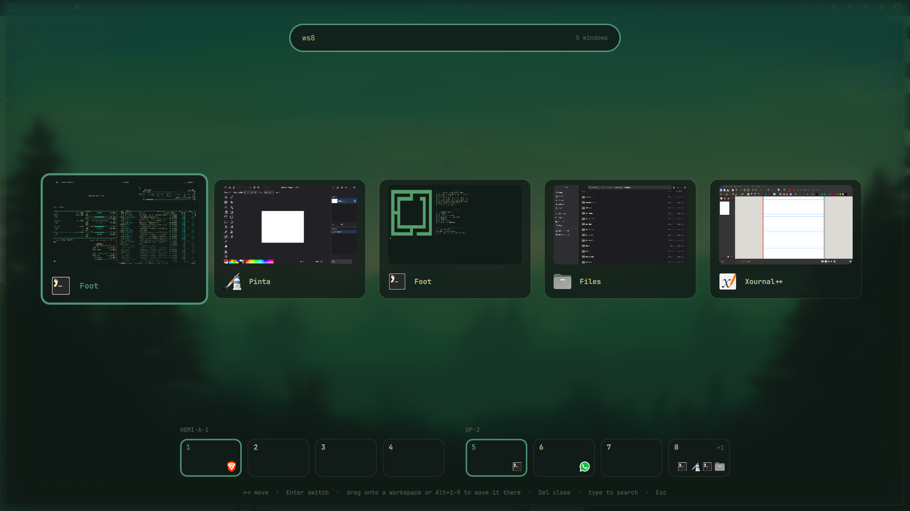

# Filmstrip

**Every open window in one row.** Filmstrip is an Omarchy shell plugin that
shows all your windows, from every workspace and every screen, as a single strip
of live previews with app icons. Switch to one with a click or Enter, or drag it
onto a workspace to move it there without leaving where you are.



## Features

- **One row, all windows.** Up to 10 windows always fit on screen, with cards
  shrinking as needed. With more, the row scrolls and follows the selection.
  The selected card is shown 10% larger.
- **Live previews** that keep each window's aspect ratio, with the **app icon**,
  name, title, and where the window lives (workspace and screen). Apps without
  an icon get a letter avatar.
- **Alt+Tab feel:** the window you used before the current one is preselected,
  so open Filmstrip and press Enter to jump back.
- **Workspace strip grouped by screen.** Drag a card onto a workspace, or press
  Alt+1..9, to move the window there. You stay where you are and Filmstrip stays
  open. Click a workspace to switch to it. Each slot shows the icons of the apps on it.
  When every workspace of a screen already has an app, that screen gets one
  extra empty slot (marked `+`). Dropping a window there creates the workspace
  on that screen.
- **Search as you type** by app, title or workspace (`ws3`). Every word has to match.
- Follows the active Omarchy theme and fonts.

## Requirements

- Omarchy 4 (Quattro) with `omarchy-shell`
- Hyprland with the Lua config (tested on 0.56.2)

No extra packages, no daemon, no sudo. Previews use Quickshell's built-in
screencopy. `node` is only needed to run the tests.

## Install

```bash
omarchy plugin add https://github.com/florinbaci/omarchy-filmstrip.git --enable
```

Then add a shortcut to `~/.config/hypr/bindings.lua`:

```lua
o.bind("SUPER + A", "Filmstrip", "omarchy-shell shell toggle io.github.florinbaci.filmstrip")
```

`SUPER + A` is free on a stock Omarchy bind set.

### Optional: open it by tapping Super alone

Hyprland 0.56 only fires a Super *release* binding with `ignore_mods = true`,
and that also fires after every Super+key combo. The snippet below opens
Filmstrip only when Super was tapped on its own: released within 400 ms with no
other key pressed in between. Add it to `~/.config/hypr/bindings.lua`:

```lua
local super_keycodes = { [133] = true, [134] = true }
local super_down_at = nil
local super_tap = false

hl.on("input.keyboard.key", function(keycode, time_ms, state)
  if super_keycodes[keycode] then
    if state == 1 then
      super_down_at = time_ms
      super_tap = false
    elseif super_down_at then
      super_tap = (time_ms - super_down_at) < 400
      super_down_at = nil
    end
  elseif state == 1 then
    super_down_at = nil
  end
end)

local function filmstrip_on_tap()
  if super_tap then
    hl.exec_cmd("omarchy-shell shell toggle io.github.florinbaci.filmstrip")
  end
end

hl.bind("SUPER + SUPER_L", filmstrip_on_tap, { release = true, ignore_mods = true, description = "Filmstrip" })
hl.bind("SUPER + SUPER_R", filmstrip_on_tap, { release = true, ignore_mods = true, description = "Filmstrip" })
```

## Use

| Key | Action |
| --- | --- |
| Left / Right, Tab / Shift+Tab, mouse wheel, Home / End | Move the selection |
| Enter, or click | Switch to the window (changes workspace if needed) |
| Drag a card onto a workspace, or Alt+1..9 | Move the window there without following it |
| Click a workspace in the strip | Switch to that workspace |
| Delete, Ctrl+W, or middle-click | Close the window |
| Type | Search; Backspace, Ctrl+Backspace and Ctrl+U edit the search |
| Esc | Clear the search, or close Filmstrip |

To open Filmstrip with a search already filled in, for example from a script:

```bash
omarchy-shell shell toggle io.github.florinbaci.filmstrip '{"filter":"ws2"}'
```

### How the workspace strip is built

The strip groups workspaces by screen, left to right. It reads Hyprland's
workspace rules (`hyprctl workspacerules -j`), so if you bind workspaces to
screens (`hl.workspace_rule({ workspace = "5", monitor = "DP-2" })`), those
workspaces show up even while they're empty. Without rules, it shows the
workspaces that currently exist.

## Remove

```bash
omarchy plugin remove io.github.florinbaci.filmstrip
```

Then delete the shortcut (and the Super-tap snippet, if you added it) from
`~/.config/hypr/bindings.lua`. Filmstrip never edits your configuration itself.

## Development

- `Windows.js` holds the pure logic: collecting and sorting windows, search,
  row sizing, the workspace strip and keyboard movement. Run the tests with
  `node --test tests/`.
- `Filmstrip.qml` is the overlay.
- After editing, run `omarchy restart shell`. Logs are in
  `/run/user/$UID/quickshell/by-id/*/log.log`.

Inspired by [IkeA](https://github.com/ike-kavas/IkeA).

## License

MIT. See [LICENSE](LICENSE).
